# Geochimp

This is my submission for the **DocuSign Good Code Hackathon 2022**.
The objective of the hackathon was to integrate geospatial field data collection and camera trap workflows for conserving chimpanzees and their habitats for the Jane Goodall Institute.

The Jane Goodall Institue uses [Survey123](https://survey123.arcgis.com/) to capture metadata about camera traps, like location, date and camera name. The photos taken by the camera traps are uploaded into folders in [MediaValet]https://www.mediavalet.com/), where the folder names are combined from camera name and date.

Tagging the photos with the relevant information that is provided by the local Forest Monitor and captured in Survey123 has been a manual process so far.
The goal of this software is to automate this process. In addition, DocuSign is to be used to get decision maker sign-off, to prevent potentially sensitive photos or other data to be shared.

## Tech-stack

The system is built using the Django web framwork and the Python programming language. For the frontend I was using Tailwind CSS.
The system is using docker-compose for easier development and deployment.

## Installation

To run the system locally, just clone the repository and then either use a virtual environemnt or develop in Docker.

To get started, create a copy of the `env.example` file and adjust the values.

If you want to develop locally, I recommend using the `dotenv` package to load the `.env` file into the environment.

You can then run the Django development server and other commands with e.g. `dotenv run -- python manage.py runserver`.

Or just use docker-compose, the setup mounts the source code folder into the container.

## How the application works

The application allows the user to upload new photos into MediaValet, tag existing photos or create maps with markers created from Survey123 submission data with photos from MediaValet attached.
A bonus feature is that the photos can have an EXIF GPS tag added during uploads, so the location information is stored in the pictures as well.

The application uses DocuSign powerforms to initiate the signing process. A custom brand is used to add a redirect back to the application, so the person completing the signing process will also initiate the tagging process or publishing of the map.

## Screenshots

#### Homepage
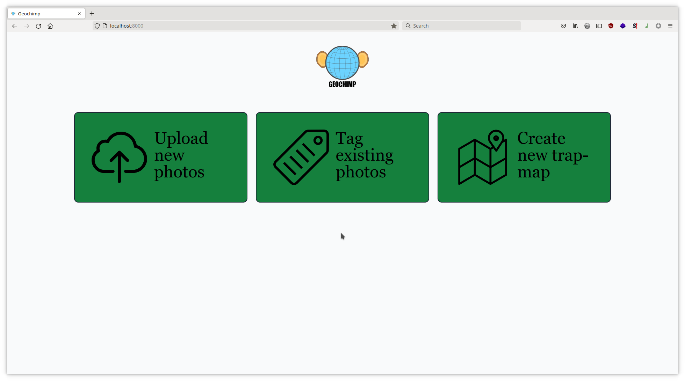

#### Choose Camera Folder
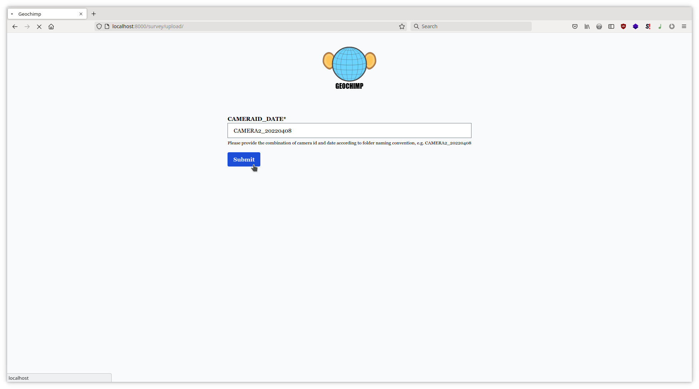

#### Upload Assets
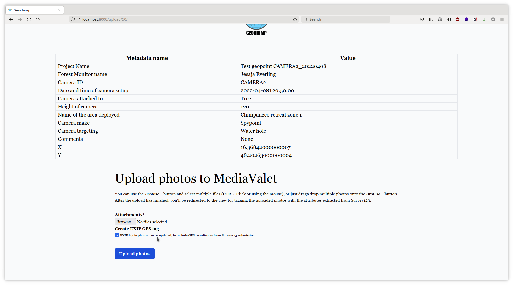

#### Request Asset tagging with DocuSign
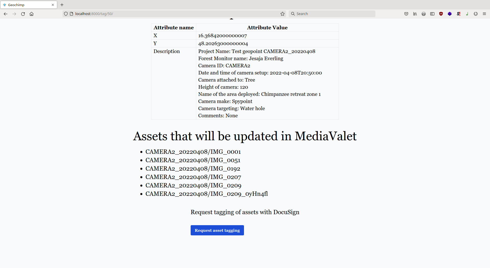

#### Choose submissions for map
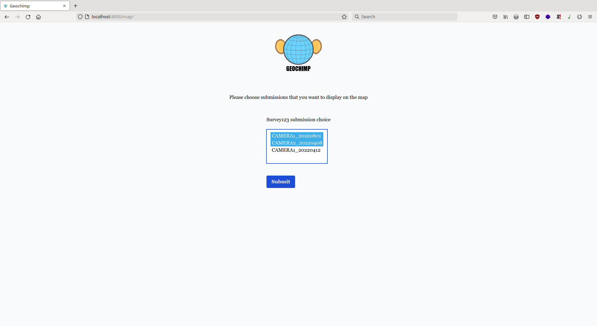

#### Unpublished map link and powerform link
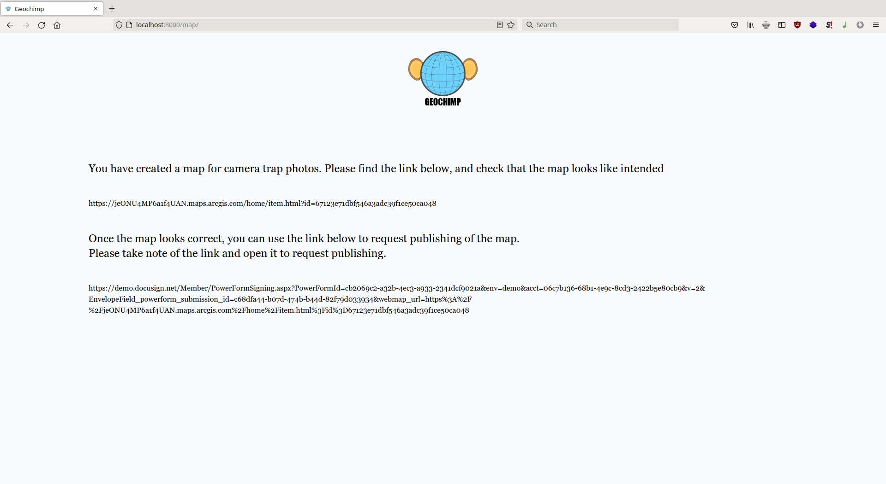

#### Map with photo from MediaValet
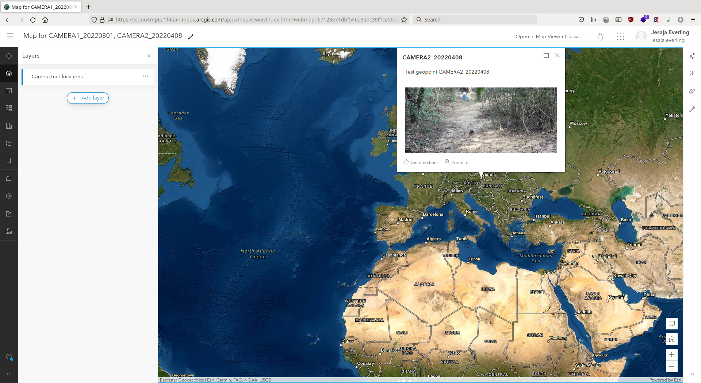

#### Checking for DocuSign completion
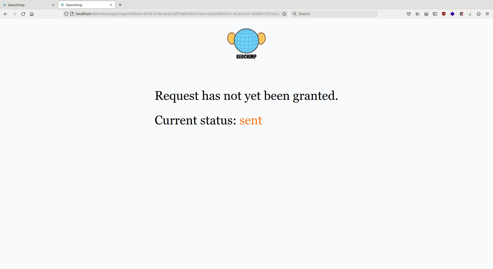

#### Request to publish
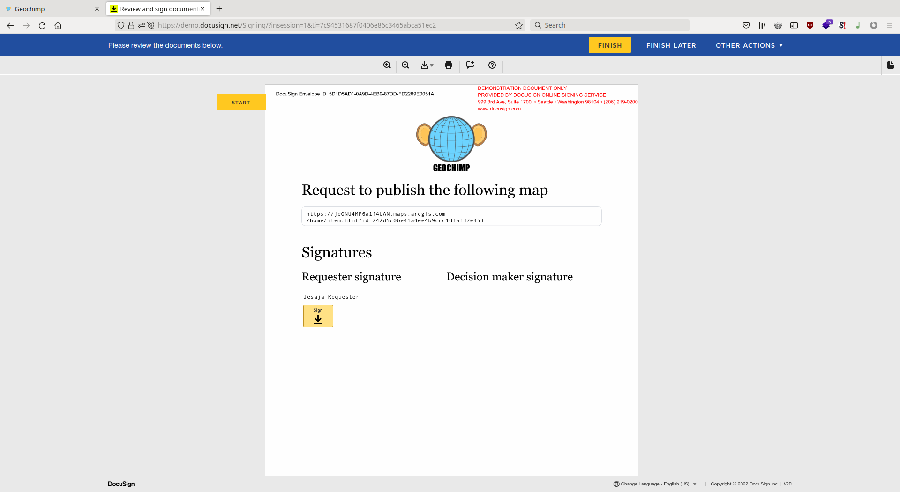

#### Redirect to application after signing
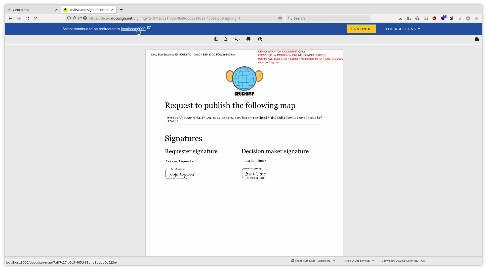

#### Map published
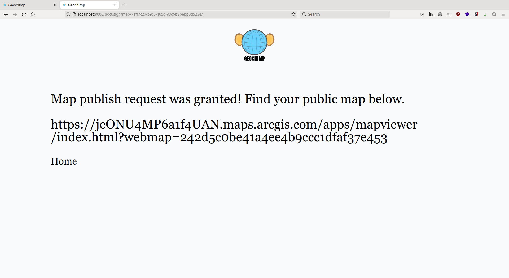

## Challenges we ran into

The biggest challenge was not being able to get better insight into the workflows and procedures of the users. Without knowing whether e.g. a submission in Survey123 could be changed at some point it was harder to choose the right data model.

## Accomplishments that we're proud of

I think the EXIF tagging is a nice bonus feature and I'm happy I was able to finish attaching photos to map markers.

## What we learned

A lot! Even how long it takes to cut a video down to 3 minutes. Please excuse the bad audio quality.
## What's next for geochimp

There is a lot of room for improvements, obviously. The first thing would be to test things more thoroughly, to take care of edge cases. There should also be automated testing.

Then I think the data model should get revisited taking client processes into account.
